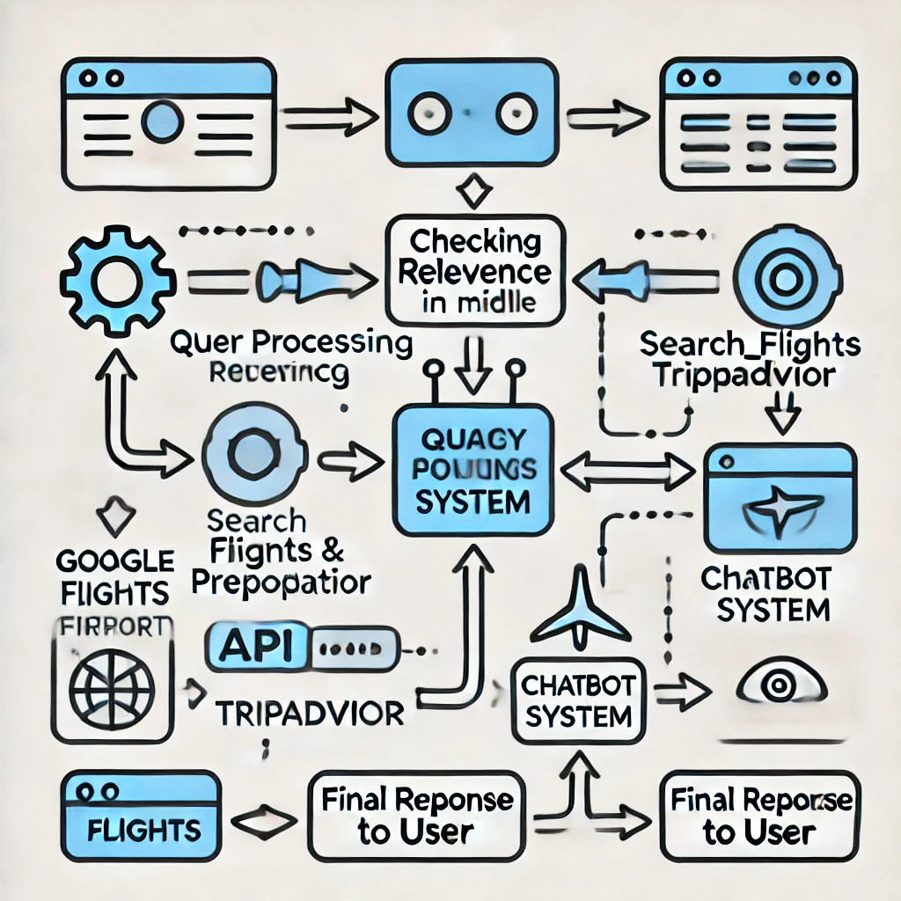
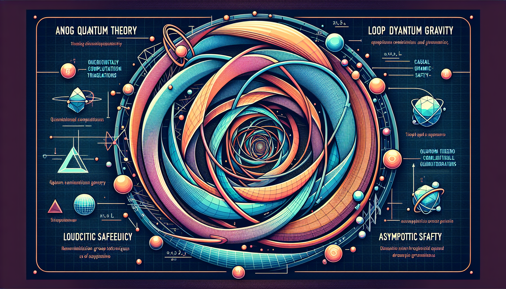

# AGENTIC AI Project

This project implements an advanced Agent AI system using OpenAI's API. The AI is capable of handling various queries by leveraging different actions such as searching the internet, performing calculations, generating plots, and more. The project also features logging capabilities to record queries, actions, and results for debugging and analysis.



## Workflow Overview

The AGENTIC AI system processes user queries through a structured and well-defined workflow, ensuring accurate and contextually relevant responses. Below is a simplified explanation of how the system operates:

1. **Start**: The process begins when the user inputs a query. This could be a question or a request for information.
   
2. **Agentic AI Process**: The central AI process interprets the query and decides which action to take based on the query's context. The AI is equipped with the ability to make decisions autonomously, selecting the most appropriate action to fulfill the user's request.

3. **Known Actions**: The AI can perform several predefined actions, including:
   - **Search Internet**: The AI fetches relevant information from the web. The retrieved snippets are then ranked based on their relevance to the query. After ranking, the top-ranked snippets are summarized using GPT to provide a concise and accurate response.
   - **Plot Line**: Creates visual plots based on the data provided and saves the result as an image.
   - **Generate Schematic**: Uses AI tools to create schematic images based on a detailed description.
   - **Ask User**: Seeks clarification from the user if the input query is ambiguous or requires further details.

4. **Logging**: Every action, query, and result is logged for reference and debugging purposes. This helps in tracking the AI's decision-making process and understanding the outcomes.

5. **Final Response**: After performing the necessary actions, the AI compiles all relevant information and provides a final, refined response to the user.

This flow ensures that the AI effectively uses available tools to generate the most accurate and relevant responses while maintaining a clear and organized process that is easy to follow.

### Example Schematic



### Example Result: Explaining Quantum Gravity Theories

next_prompt wikipedia performed, resulting in Observation: competing <span class="searchmatch">theories</span> which have been proposed. Thought experiment approaches have been suggested as a testing tool for <span class="searchmatch">quantum</span> <span class="searchmatch">gravity</span> <span class="searchmatch">theories</span>. In the field, next_prompt: what are the most important quantum gravity theories, rank them and explain why and explain their approach, plotschematics images to explain better

next_prompt search_internet performed, resulting in Observation: The quest for a comprehensive theory of quantum gravity (QG) remains a central challenge in modern theoretical physics, as current understanding is limited despite significant advancements. QG aims to describe gravity through quantum mechanics in contexts where both gravitational and quantum effects are significant, such as near black holes and during the universe's early phases. The field emerged from the need to unify quantum mechanics and general relativity, leading to developments in various mathematical frameworks and competing theories, primarily string theory and loop quantum gravity.

Notably, a new approach proposed by Jonathan Oppenheim suggests retaining gravity as a classical theory while coupling it to quantum theory via a probabilistic mechanism. Recent papers from University College London announce a radical unification of gravity and quantum mechanics that aligns with Einstein’s classical spacetime concept. The urgency for a quantum theory that can extend beyond general relativity is heightened by recent breakthroughs in gravitational observation.

The historical complexity of quantum gravity theories, including insights from quantum information theory and efforts from the mid-1980s using string theory, continues to shape the discourse. Some quantum gravity theories suggest that high-energy photons may interact with the vacuum as if it were a medium, prompting investigations such as those conducted by the Large High Altitude Air Shower Observatory in China that examine Lorentz invariance in gamma-ray bursts, with no observed violations thus far.

next_prompt generate_schematic_image performed, resulting in Observation: schematics plotted and saved to result_image/schematic_image.png

next_prompt search_internet performed, resulting in Observation: The quest for a comprehensive theory of quantum gravity (QG) remains a central challenge in modern theoretical physics, as current understanding is limited despite significant advancements. QG aims to describe gravity through quantum mechanics in contexts where both gravitational and quantum effects are significant, such as near black holes and during the universe's early phases. The field emerged from the need to unify quantum mechanics and general relativity, leading to developments in various mathematical frameworks and competing theories, primarily string theory and loop quantum gravity.

Notably, a new approach proposed by Jonathan Oppenheim suggests retaining gravity as a classical theory while coupling it to quantum theory via a probabilistic mechanism. Recent papers from University College London announce a radical unification of gravity and quantum mechanics that aligns with Einstein’s classical spacetime concept. The urgency for a quantum theory that can extend beyond general relativity is heightened by recent breakthroughs in gravitational observation.

The historical complexity of quantum gravity theories, including insights from quantum information theory and efforts from the mid-1980s using string theory, continues to shape the discourse. Some quantum gravity theories suggest that high-energy photons may interact with the vacuum as if it were a medium, prompting investigations such as those conducted by the Large High Altitude Air Shower Observatory in China that examine Lorentz invariance in gamma-ray bursts, with no observed violations thus far.

## Installation

1. Clone the repository.
2. Install the dependencies:

    ```bash
    pip install -r requirements.txt
    ```

3. Set up your environment variable for the OpenAI API key:

    ```bash
    export OPENAI_API_KEY='your-api-key-here'
    ```

## Usage

To start the chatbot, run the `main.py` file:

```bash
python main.py
# Agent-travel
