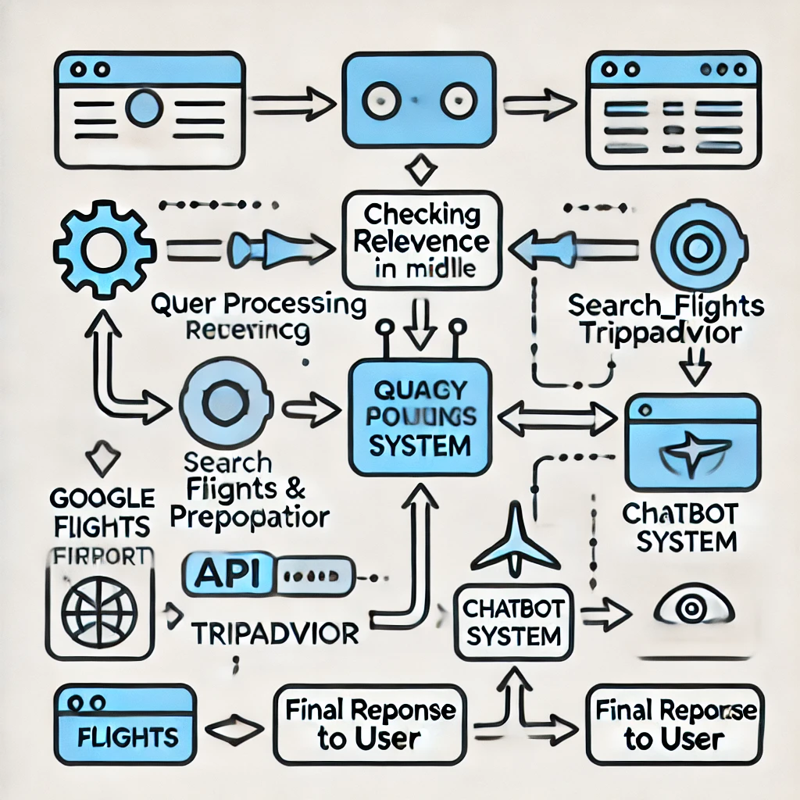

# AGENTIC AI Project

This project implements an advanced Agentic AI system using OpenAI's API, designed to handle various queries related to vacation planning and travel searches. The AI autonomously performs actions such as querying flight information, searching for hotels, ranking results, and providing recommendations based on user preferences. The project features structured logging to record queries, actions, and results for debugging and further analysis.

## Workflow Overview

The AGENTIC AI system follows a structured workflow to ensure accurate and contextually relevant responses. Below is a simplified explanation of the system's operation:

1. **User Input**: The process begins when the user inputs a travel-related query, such as flight searches or hotel recommendations.

2. **Query Relevance Check**: The system checks if the query is relevant to vacation planning or travel searches. If relevant, it proceeds to prepopulate preferences.

3. **Prepopulate Preferences**: Based on the user's query, the system generates a JSON object with travel preferences like budget, preferred airports, flight time, and accommodation preferences. If any preference data is missing, the system prompts the user to fill in the gaps.

4. **Agentic AI Process**: 
   - The AI analyzes the query and determines which action to take, such as searching for flights or hotels. 
   - It can autonomously decide the best action based on the context of the query and the user's preferences.

5. **Known Actions**:
   - **Search Flights**: The AI uses travel APIs like Google Flights to search for flights based on user preferences such as budget, preferred departure airports, and flight time.
   - **Search Hotels (TripAdvisor)**: The system fetches data from APIs like TripAdvisor to provide hotel recommendations based on user criteria such as budget, rating, and amenities.
   - **Ask User**: If needed, the system prompts the user for clarification or additional preferences.
   - **Search Internet**: The AI fetches relevant information from the web, ranks the snippets, and provides a concise summary.
   - **Generate Schematic**: Uses AI tools to generate schematic images based on detailed descriptions.

6. **Logging**: All actions, queries, and results are logged for reference and debugging. This helps track the AI's decision-making process and the outcome of each action.

7. **Final Response**: After performing the necessary actions, the AI compiles and delivers a final, refined response to the user.

This workflow ensures the AI can handle complex travel-related queries efficiently and provide personalized responses based on user preferences.

## Example Workflow

1. **User Input**: 
    - _"I want to book a flight to Paris and stay in a hotel with a pool."_
2. **Query Relevance Check**:
    - The system identifies the query as relevant to travel and begins processing.
3. **Prepopulate Preferences**:
    - The system generates preferences such as budget, preferred flight time, and preferred airport. Missing information, such as budget, is requested from the user.
4. **Flight and Hotel Search**:
    - The system searches for available flights and hotel options using APIs like Google Flights and TripAdvisor, ranking results based on user preferences.
5. **Final Response**:
    - The AI delivers a list of ranked flight and hotel options, complete with details like pricing and amenities.

### Example Schematic


The above diagram illustrates how the AI system processes travel-related queries and generates responses based on the user's preferences.

## Installation

1. Clone the repository.
2. Install the dependencies:

    ```bash
    pip install -r requirements.txt
    ```

3. Set up your environment variables for the API keys (OpenAI, Google Flights, TripAdvisor, etc.):

    ```bash
    export OPENAI_API_KEY='your-api-key-here'
    export TRIPADVISOR_API_KEY='your-tripadvisor-api-key-here'
    ```

## Usage

To start the chatbot, run the `main.py` file:

    ```bash
    python main.py
    ```

This will launch the AI system, ready to handle queries related to vacation planning and flight/hotel searches.

# Example Usage

Input a query like:
bash
Copy code
I want to book a flight to New York and stay in a hotel with free WiFi.
The system will process the query, check for relevance, prepopulate preferences, and fetch flight/hotel recommendations based on user preferences.


# Building an AI Travel Assistant with Python and OpenAI

Artificial Intelligence (AI) agents are transforming the way we interact with technology. From personal assistants to travel planners, AI agents can handle complex queries, automate tasks, and deliver personalized recommendations. In this article, we’ll walk through the creation of a **travel assistant** using **Python**, **OpenAI's GPT**, and **external APIs** like TripAdvisor and Expedia. The assistant is designed to run in a terminal, providing an interactive and personalized travel planning experience.

---

## 🚀 What is an AI Agent?

An AI agent is a system that can perceive its environment, process information, and take actions to achieve predefined goals. In the context of travel planning, AI agents can:
- **Understand user preferences** through a detailed profile setup.
- **Search for relevant travel information** using APIs like TripAdvisor and Expedia.
- **Rank results** based on preferences like price, location, and timing.
- **Engage in a conversation** to refine travel suggestions.

Our **AI Travel Assistant** combines **OpenAI's GPT models**, **TripAdvisor APIs**, and a **terminal-based interface** to provide an interactive and personalized travel planning experience.

---

## 🛠️ Tech Stack
- **Python** – The primary programming language.
- **OpenAI GPT** – For natural language processing and generating conversational responses.
- **TripAdvisor & Expedia APIs** – For retrieving travel data (e.g., flights, accommodations, activities).
- **Logging & State Management** – To improve usability and debugging.

---

## 📌 Setting Up the Project

To get started, install the required dependencies:
```bash
pip install openai requests


The project is organized into the following folder structure:

```bash

|____chatbot
| |____config.py
| |____bot.py
| |____utils.py
|____actions_def
| |____search_flights.py
| |____fetch_from_tripadvisor.py
| |____fetch_from_expedia.py
| |____rank_flights_by_price.py
| |____rank_travel_plans.py
|____main.py
|____pyproject.toml
|____README.md

```


🏗️ Building the Travel Assistant
1️⃣ Setting Up the Terminal Interface
The main.py file initializes the chatbot with a profile setup and chat interface. It uses a terminal-based approach to interact with the user.


```bash
import logging
import openai
from actions_def.check_query_relevance import check_query_relevance
from actions_def.populate_preferences import populate_preferences
from chatbot.bot import ChatBot
from chatbot.config import api_config, required_fields
from chatbot.utils import process_query

openai.api_key = api_config["OPENAI_API_KEY"]

logging.basicConfig(
    filename="companion_logs.log",
    level=logging.INFO,
    format="%(asctime)s - %(levelname)s - %(message)s",
    datefmt="%Y-%m-%d %H:%M:%S",
)

class UserSession:
    def __init__(self):
        self.user_profile = {}
        self.chat_history = []
        self.setup_complete = False

def display_chat_history(chat_history):
    """Display chat history in terminal."""
    for message in chat_history:
        prefix = "🤖 Assistant:" if message["role"] == "assistant" else "👤 You:"
        print(f"\n{prefix} {message['content']}")

def setup_profile(required_fields: dict, session: UserSession):
    """Set up user profile through terminal input."""
    print("\n🔧 Let's set up your profile!")
    
    for field, options in required_fields.items():
        print(f"\n📝 {field.replace('_', ' ').title()}:")
        if isinstance(options, list):
            for i, option in enumerate(options, 1):
                print(f"{i}. {option}")
            while True:
                try:
                    choice = int(input("Enter the number of your choice: "))
                    if 1 <= choice <= len(options):
                        session.user_profile[field] = options[choice-1]
                        break
                    print("Invalid choice. Please try again.")
                except ValueError:
                    print("Please enter a number.")
        else:
            session.user_profile[field] = input("Enter your response: ")
    
    session.setup_complete = True
    print("\n✅ Profile setup complete!")

def display_profile(session: UserSession):
    """Display user profile in terminal."""
    print("\n👤 Your Profile:")
    for key, value in session.user_profile.items():
        print(f"{key.replace('_', ' ').title()}: {value}")

def main(required_fields: dict):
    """Main application."""
    print("\n👋 Welcome to Your Friendly Computer Helper!")
    print("=" * 50)
    
    session = UserSession()
    
    while True:
        if not session.setup_complete:
            setup_profile(required_fields, session)
            continue
        
        print("\n🔍 Available commands:")
        print("1. Ask a question")
        print("2. View profile")
        print("3. Update profile")
        print("4. Clear chat history")
        print("5. Exit")
        
        try:
            choice = input("\nEnter your choice (1-5): ")
            
            if choice == "1":
                user_query = input("\n💭 What would you like help with? ")
                if user_query.lower() == 'exit':
                    break
                    
                session.chat_history.append({"role": "user", "content": user_query})
                result = process_query(user_query)
                session.chat_history.append({"role": "assistant", "content": result})
                display_chat_history(session.chat_history)
                
            elif choice == "2":
                display_profile(session)
                
            elif choice == "3":
                session.setup_complete = False
                session.user_profile = {}
                print("\n🔄 Let's update your profile!")
                
            elif choice == "4":
                session.chat_history = []
                print("\n🗑️ Chat history cleared!")
                
            elif choice == "5":
                print("\n👋 Goodbye! Have a great day!")
                break
                
            else:
                print("\n❌ Invalid choice. Please try again.")
                
        except KeyboardInterrupt:
            print("\n\n👋 Goodbye! Have a great day!")
            break
            
        except Exception as e:
            logging.error(f"Error occurred: {str(e)}")
            print("\n❌ An error occurred. Please try again.")

if __name__ == "__main__":
    main(required_fields)
```


This terminal-based app:

Collects user queries about travel.

Displays a conversation history for reference.

Processes user input with the AI agent.

2️⃣ Implementing the ChatBot Logic
The bot.py file contains the ChatBot class, which interacts with OpenAI’s API and manages conversation history.

```bash

import openai
from typing import List, Dict

class ChatBot:
    def __init__(self, system_prompt: str = ""):
        self.system_prompt = system_prompt
        self.conversation_history: List[Dict[str, str]] = []

    def process_message(self, user_message: str) -> str:
        self.conversation_history.append({"role": "user", "content": user_message})
        completion = openai.ChatCompletion.create(
            model="gpt-4",
            messages=self.conversation_history
        )
        response = completion["choices"][0]["message"]["content"].strip()
        self.conversation_history.append({"role": "assistant", "content": response})
        return response


```


This chatbot:

Stores conversation history to provide context-aware responses.

Sends queries to OpenAI’s GPT model to generate travel recommendations.

3️⃣ Defining User Preferences
To improve recommendations, we collect user preferences such as budget, travel dates, and accommodation type. These preferences are defined in config.py.

```bash

required_fields = {
    "budget": ["Economy", "Mid-range", "Luxury"],
    "preferred_airline": ["Any", "Delta", "United", "Emirates"],
    "accommodation": ["Hotel", "Hostel", "Airbnb", "Resort"],
    "activities": ["Beach", "Hiking", "City Tours", "Museums"]
}

```

Users select preferences through the terminal interface, and the chatbot tailors its recommendations accordingly.

4️⃣ Integrating External APIs
To fetch real-world travel data, we connect to the TripAdvisor API and Expedia API. For example, the search_flights.py file handles flight searches:


```bash


import requests

def search_flights(destination: str, api_key: str):
    url = f"https://api.expedia.com/flights?query={destination}&key={api_key}"
    response = requests.get(url)
    return response.json()

```


This function:

Calls the Expedia API to retrieve flight details.

Parses the response to extract relevant travel information.

🔥 Enhancing the Travel Assistant
🏆 Ranking Travel Options
To rank flights based on user preferences, we implement a scoring system in rank_flights_by_price.py:

```bash

def rank_flights(flights, user_preferences):
    ranked = sorted(
        flights, key=lambda x: (user_preferences["budget"] == x["class"], x["price"])
    )
    return ranked

```

🛠️ Handling Edge Cases
To avoid errors:

Check if APIs return valid data before displaying results.

Handle API rate limits by implementing retry logic.

🧠 Future Improvements
Enhance NLP capabilities to handle complex queries.

Improve ranking algorithms using machine learning models.

Add real-time price alerts for better travel deals.

🎯 Final Thoughts
With AI-powered travel assistants, users can receive personalized, real-time recommendations tailored to their preferences. By combining OpenAI's GPT with external APIs and a terminal-based interface, we can create seamless, intelligent travel planning experiences.

🚀 Want to build your own AI travel assistant? Start by experimenting with the code above and customizing it to your needs!

Do you have ideas for improving this AI travel assistant? Let’s discuss in the comments! 🎉


